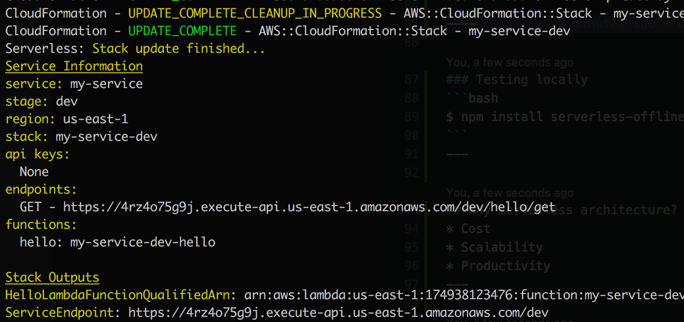
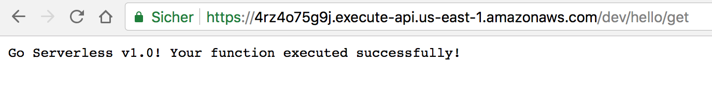

#### A talk about
# Serverless
Stefan Schwartze
---

## A typical Node server architecture

---

## Things to master
* Database
* Authentication
* Scaling
* CI / CD
---

## Simple express application

----


----


----

## Kill the server

---


Note:
1. We’ve deleted the authentication logic in the original application and have replaced it with a third-party BaaS service (e.g., Auth0.)
2. Another BaaS, accesing database directly from client (e.g. Firebase)
3. More logic in the client (authentication, DB connection)
4. Keep UX functionality, just execute them on the server. Example: search function, also processing larger amounts of data
5. Keep security relevant functions like purchasing on the server
---

## FaaS
**F**unctions **a**s **a** **s**ervice
----

> Fundamentally, FaaS is about running backend code without managing your own server systems or your own long-lived server applications.<br/>
-- Mike Roberts
---

## Using compute services
* Run your functions in the cloud
----

### AWS Lambda
> AWS Lambda is a compute service that lets you run code without provisioning or managing servers.<br/>
—- AWS Documentation
----

### AWS Gateway
* Gateway for providing endpoints
* Executes function in response to events
```javascript
app.get('/', function(req, res, next) { /* execute some code */ });
```
---

### AWS config is always pain
---

## Serverless to the rescue
----

> Serverless is your toolkit for deploying and operating serverless architectures. Focus on your application, not your infrastructure.
— Serverless.com
----

### Setting up
```bash
$ npm install -g serverless
```
```bash
$ serverless config credentials --provider aws --key xxxxxxxxxxxxxx --secret xxxxxxxxxxxxxx
```
----

### Create a service
```bash
$ serverless create --template aws-nodejs --path my-service
```
----

### serverless.yml
* Config file for all settings

```yaml
service: my-service

provider:
  name: aws
  runtime: nodejs6.10

functions:
  hello:
    handler: handler.hello
    events:
      - http:
          path: hello/get
          method: get
```
----

### Writing a first function
```javascript
module.exports.hello = (event, context, callback) => {
  const response = {
    statusCode: 200,
    body: 'Go Serverless v1.0! Your function executed successfully!',
  };
  callback(null, response);
};
```
----

### Deploy and go!
```bash
$ serverless deploy -v
```

----


----

### Testing locally

*Install*

```bash
$ npm install serverless-offline --save-dev
```
*Setup*

```yaml
...

plugins:
  - serverless-offline
```
*Run*

```bash
$ serverless offline start
```
---

## Why serverless architecture?
----

#### Scalability

----

#### Cost

* Only pay for running the functions
Note:
* AWS Lambda: 0.20$ / 1 million calls
----

#### Productivity
* Developers can focus on product development
* Less worry about architecture
---

## Why serverless framework?
* Simplifies setting up
* Vendor-independent
* Ecosystem
---

## Disadvantages
* Not suitable for long-term tasks
* No websockets with Lambda
* "Cold starts"
---

## Sources

* [Slobodan Stojanivic](https://medium.freecodecamp.org/express-js-and-aws-lambda-a-serverless-love-story-7c77ba0eaa35)
* [Adnan Rahic](https://hackernoon.com/a-crash-course-on-serverless-with-node-js-632b37d58b44)
* [Martin Fowler](https://martinfowler.com/articles/serverless.html)
* [Serverless docs](https://serverless.com/framework/docs/)